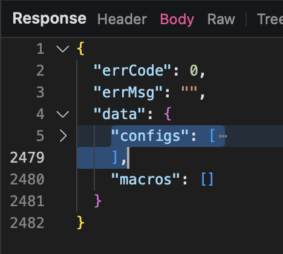

# fun60-keymap

### Prerequisites
- [Proxyman](https://proxyman.io/) installed
- Monsgeek Driver software installed

### Steps

1. **Set up Proxyman**
   - Launch Proxyman
   - Enable HTTP/HTTPS proxying
   - Make sure your system is configured to use Proxyman as proxy

2. **Set up Monsgeek Software**
   - Open Monsgeek software
   - Log in to your account
   - Navigate to cloud backup feature under Profile

3. **Create Cloud Backup**
   - Start a cloud backup process to upload your current configuration

4. **First Cloud Backup Download**
   - Perform a cloud backup download to get your current configuration
   - Note this will be the one we end up actually modifying in later steps

5. **Set up Local Response Mapping**
   - In Proxyman, look for the API request from the backup download process
   - Right-click on the backup download request and select "Map Local"
   - Set up a local response mapping for this endpoint
   
   
   *This shows the part of the response that needs to be replaced with the funkier60 configuration*

6. **Prepare Modified Configuration**
   - Open the `funkier60.json` file
   - Replace the "configs" entry in your local mapped response with the funkier60 configuration

7. **Second Cloud Backup Download with Modified Response**
   - With local mapping enabled in Proxyman, perform another cloud backup download
   - This download should now return the modified keymap from your local mapping

8. **Apply the Modified Keymap**
   - In Monsgeek software, switch to the modified fn layer keymap
   - The new keymap configuration should now be active

9. **Restart if Needed**
   - If changes don't appear immediately, restart Monsgeek software
   - The keymap should work, though the software might have some difficulty displaying the fn layer correctly when editing, but the changes should stick

### Notes
- Make sure Proxyman is properly intercepting HTTPS traffic
- Keep a backup of your original configuration before attempting this process
- This process may need to be repeated if the software updates
- You will need a basic understanding of how to work with Proxyman or any other tool you with to modify the POST response with

reference keycodes for the json
