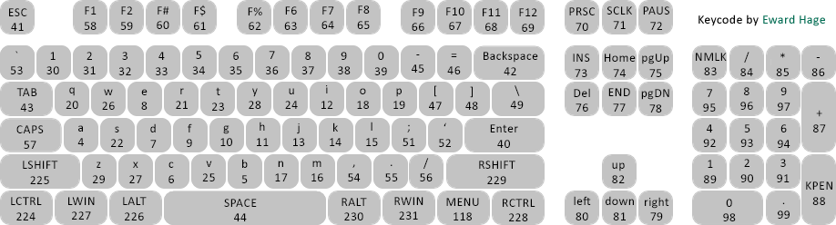

# fun60-keymap

### Prerequisites
- [Proxyman](https://proxyman.io/) installed
- Monsgeek Driver software installed

### Steps

1. **Set up Proxyman**
   - Launch Proxyman
   - Enable HTTP/HTTPS proxying
   - Make sure your system is configured to use Proxyman as proxy

2. **Initiate Cloud Backup**
   - Open Monsgeek software
   - Navigate to cloud backup feature under Profile
   - Start a cloud backup process

3. **Intercept the API Request**
   - In Proxyman, look for the POST API request to the backup endpoint
   - The request should appear in the traffic list during the backup process

4. **Modify the Request**
   - Right-click on the backup POST request
   - Select "Edit and Retry" or whats it called
   - In the request body, replace the existing content with `funkier60`
   - add your user.id, user.name and user.email to both layers of funkier60 json (you can see the id in the 3rd steps json)
   - Send the modified request

5. **Retrieve Modified Backup**
   - Return to Monsgeek software
   - Restore/download your newly created cloud backup
   - The backup should now contain the modified keymap

6. **Restart if Needed**
   - If changes don't appear immediately, restart Monsgeek software
   - Whilst the keymap might work the software might have some difficulity displaying correctly the fn layer once you start editing it, though the changes should stick

### Notes
- Make sure Proxyman is properly intercepting HTTPS traffic
- Keep a backup of your original configuration before attempting this process
- This process may need to be repeated if the software updates

reference keycodes for the json
